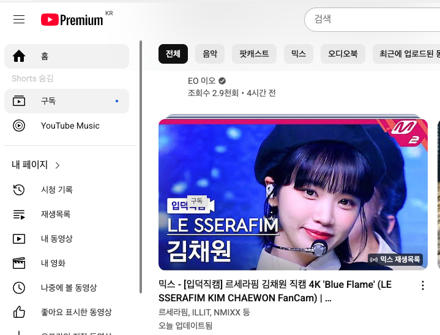

<!-- README.md  ------------------------------------------------------->
# 📵 YouTube **Shorts Blocker**

> **Take back the remote.**  
> Regular YouTube videos can be paused, queued, or simply ignored.  
> **Shorts cannot** – there is no “off” switch, no preference pane, no way to
> keep them out of your feed. They are engineered to hijack attention (TikTok
> proved how effective the endless-swipe format is).  
> Since Google won’t give you the option, **this extension does.**

<p align="center">
  
</p>

---

## ✨ What it does
| Before | After |
|--------|-------|
| “Shorts” button in the sidebar keeps tempting you. | Replaced with a faint “Shorts hidden” line – so you know it’s gone. |
| Home/Search/Subs pages scatter bright Shorts shelves between videos. | Every Shorts shelf is stripped out, feed scrolls normally. |
| Clicking a random video sometimes drops you into Shorts anyway. | Any leftover Shorts thumbnails are removed at source. |

* Works in both **Mini-Guide** (collapsed sidebar) and **Full-Guide** layouts.  
* Reacts instantly to SPA navigation with a `MutationObserver` + YouTube’s
  `yt-navigate-finish` event.  
* Pure content script – **< 3 KB, no special permissions.**  
* Manifest V3 compliant (Chrome 123+, Edge, Brave, Vivaldi…).

---

## 🛠  Installation (30 seconds)

1. Clone or download this repo  
```bash
   git clone https://github.com/your-name/youtube-shorts-blocker.git
```

2. Open Chrome → `chrome://extensions`
3. Toggle **Developer mode**
4. **Load unpacked** → select the folder you just cloned
5. Refresh YouTube – enjoy a Shorts-free experience!

> **Keep updated:** if YouTube changes its HTML, just pull the latest commit
> and hit “Reload” on the extension.

---

## 📂 File structure

```
youtube-shorts-blocker/
├─ manifest.json      # MV3 manifest
├─ content.js         # < 300 lines that nuke Shorts
├─ icon128.png        # extension icon
└─ assets/
   └─ screenshot-*.png
```

---

## 🤝 Contributing

Pull requests are welcome – especially if you notice a new Shorts selector
slipping through.
Make sure to test on both narrow **Mini-Guide** and wide **Full-Guide** layouts.

---

## ⚖️ License

Released under the [MIT](LICENSE) License.
